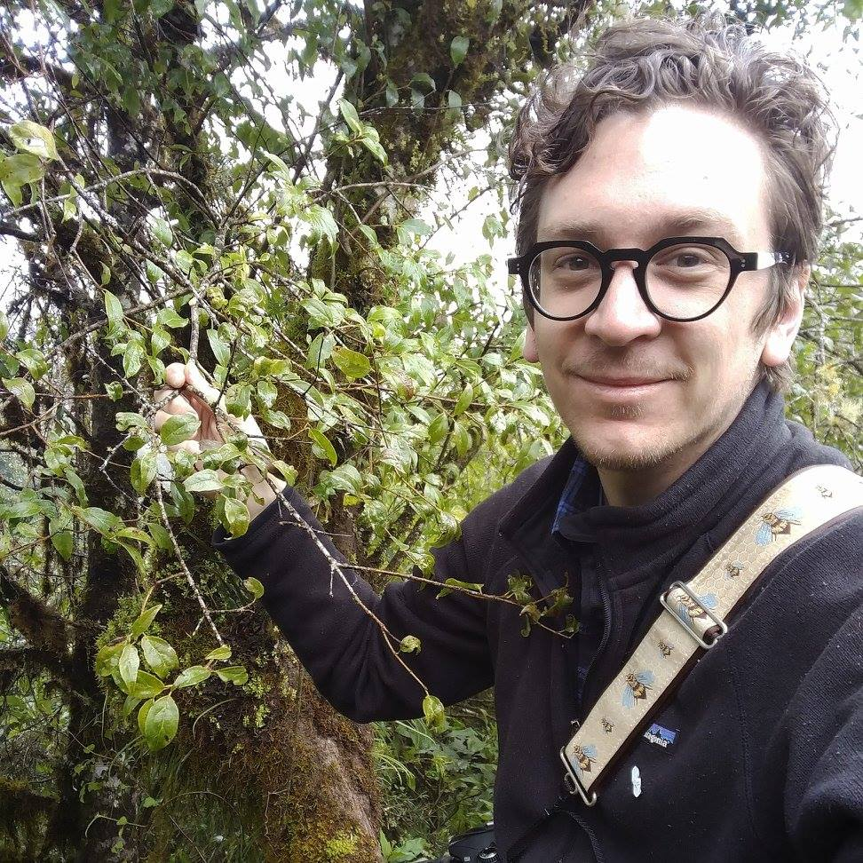
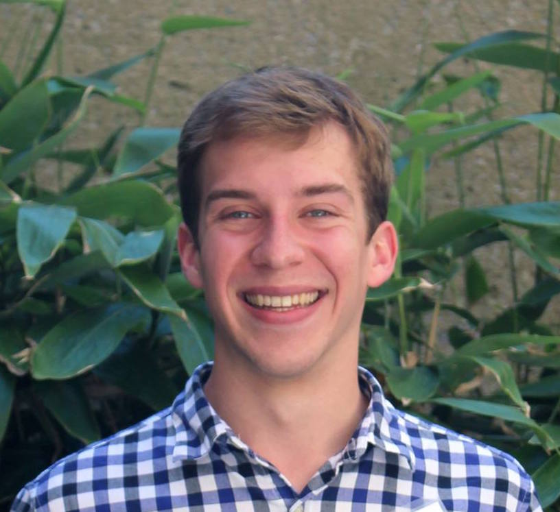

The Eaton lab is looking to recruit motivated post-docs, Ph.D,
Masters, and Undergraduate students to work on plant, ecology and evolution,
and computational genomics research. If you are interested in joining the lab
follow this link ([joining the lab](#joining-the-lab)) and contact us.

### PI: Deren Eaton

<!-- https://c1.staticflickr.com/6/5323/31076258402_63f8612588_z.jpg"> -->

Deren is an Assistant Professor in the Department of Ecology, Evolution, 
and Environmental Science (E3B) at Columbia University. 
He is an evolutionary biologist and botanist with broad interests 
in plant biodiversity -- from the scale of global patterns and community 
assembly, to speciation and genetic variation within species. 
Deren's research is rooted in organismal biology and fieldwork, 
with projects focused in the Tibetan plateau and cloud forests of 
Central and South America. An common theme across his work
is the development of new computational or statistical methods 
for analyzing comparative data, and the implementation and 
support for reproducible science. Deren completed a 
postdoc at Yale in 2017; earned his PhD from the University
of Chicago in 2014; and his BSc from the University of Minnesota in 
2007.

contact: [de2356@columbia.edu](mailto:de2356@columbia.edu)

 

### Post-docs

Sandra Hoffberg joined the lab in 2017 as an NSF Postdoctoral Fellow.
Sandra's work is focused on the development of tools and resources to 
expediate large-scale genotyping and bioinformatic analyses of 
germplasm databases (i.e., seed databases) for agriculture and 
plant breeding research. Her work combines genomics, phylogenetics, 
and functional trait evolution, including the study of herbicide 
resistance, and invasiveness. Sandra completed her PhD in 2017 at the 
University of Georgia. 

contact: [slh2181@columbia.edu](mailto:slh2181@columbia.edu)

<!-- a href="../images/Sandra-photo.jpg">
    
</a -->

 
### Graduate Students

Patrick McKenzie joined the lab in 2017, and was a recipient of the 
an NSF Graduate Research Fellowship (GRFP). Patrick is interested in plant 
phylogenetics and comparative methods, and has worked on predictive modeling 
in forest communities. He completed his BSc from the University of Tennessee 
in 2017. 

contact: [p.mckenzie@columbia.edu](mailto:p.mckenzie@columbia.edu)

 
### Joining the lab:

##### Postdocs
I'm currently looking to recruit postdocs to work on independent projects in
the lab and/or to join ongoing projects. I encourage people to contact me about
writing proposals for the coming year for available postdoc fellowships.
Some great resources to find fellowships are available
[here](http://mathbionerd.blogspot.com/2014/04/some-postdoctoral-fellowships-in-biology.html)
and [here](http://people.ds.cam.ac.uk/dl384/Resources_Postdocs.html). 
Please email Deren with your CV if you'd like to discuss
fellowship opportunities.
