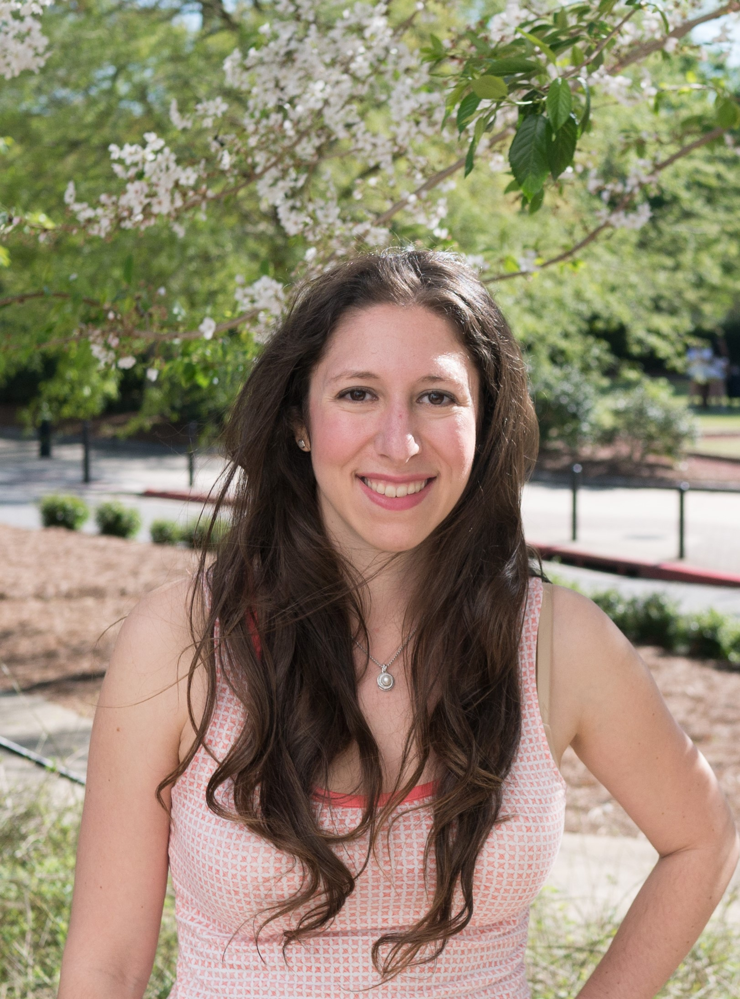

The Eaton lab is looking to recruit motivated post-docs, Ph.D,
Masters, and Undergraduate students to work on plant, ecology and evolution,
and computational genomics research. If you are interested in joining the lab
follow this link ([joining the lab](#joining-the-lab)) and contact us.

### PI: Deren Eaton

Deren is an Assistant Professor in E3B at Columbia University. 
He is an evolutionary biologist and botanist with broad interests 
in plant biodiversity -- from the scale of global patterns and community assembly, to 
speciation and genetic variation. Deren's research is rooted in organismal biology
and has included substantial fieldwork in the Tibetan plateau and cloud forests of Central and South America. His work also focuses on the development of methods for
analyzing genomic data and performing statistical comparative tests among species.
He is also major advocate for reproducible science. Deren completed a 
postdoc at Yale University in 2017; earned his PhD in 2014 from the University of Chicago; and his BA in 2007 from the University of Minnesota.

contact: [de2356@columbia.edu](mailto:de2356@columbia.edu)

<!-- figure>
	
	<figcaption> Deren enjoying a killer torta in Mexico City</figcaption>
</figure -->

### Post-docs

Sandra Hoffberg joined the lab in 2017 as an NSF Postdoctoral Fellow.
Sandra's work is focused on developing resources to simplify and expediate
large-scale genotyping and bioinformatic analyses of germplasm databases
(i.e., seed databases). Her work combines genomics, phylogenetics, and 
functional trait evolution, including the study of herbicide resistance, 
and invasiveness. Sandra completed her PhD in 2017 at the University of 
Georgia. 

<!-- a href="../images/Sandra-photo.jpg">
    
</a -->

### Graduate Students
... coming soon.
<!-- Patrick McKenzie will be joining the lab this fall as an incoming Ph.D. student.
Patrick is joining us from the University of Tennessee where he recently completed
his undergraduate degree.
 -->
<!-- <figure class="third">
	
	
	
	<figcaption>Graduate Students.</figcaption>
</figure> -->

### Joining the lab:

##### Postdocs
I'm currently looking to recruit postdocs to work on independent projects in
the lab and/or to join ongoing projects. I encourage people to contact me about
writing proposals for the coming year for available postdoc fellowships.
Some great resources to find fellowships are available
[here](http://mathbionerd.blogspot.com/2014/04/some-postdoctoral-fellowships-in-biology.html)
and [here](http://people.ds.cam.ac.uk/dl384/Resources_Postdocs.html).
Please email me with your CV if you'd like to discuss
fellowship opportunities.
